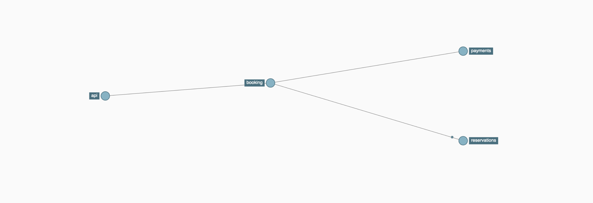

# OpenTelemetry Sample Application

A Simple Reservation system with microservices api/booking/reservations/payments

- All the services are instrumented using OpenTelemetry Python Agent
- The Application can be deployed on Kubernetes cluster 
- The kubernetes deployment has OpenTelemetry collector configured to collect Kubernetes Pod/Node 
  metrics 
- The deployment has Zipkin and Prometheus stores to visualize Traces and Metrics
- The following services are exposed as NodePort services
  - Api Service (exposed on Port 30001)
  - Prometheus Service (exposed on Port 30002) 
  - Zipkin (exposed on Port 30003)  

## Usage

### Building images
- $ `docker-compose build`

### Running the Application 

Once you have Kubernetes cluster (docker-desktop, minikube, EKS, GKE), apply the deployment files.
NodePort services for application gateway, prometheus, zipkin are exposed on NodePort services on 
30001, 30002, 30003 respectively 

- $ `kubectl apply -f k8/`

-  Traces `<domain> = localhost` (if running locally)
   - Can be generated doing a GET on API service  `curl -v http://<domain>>:30001/book/somerandom`
   - Can be visualized in Zipkin `http://<domain>:30003` 
-  Metrics `<domain> = localhost` (if running locally)
   - Can be viewed on prometheus hosted `http://<domain>:30002/`

- $ `kubectl delete -f k8/`

