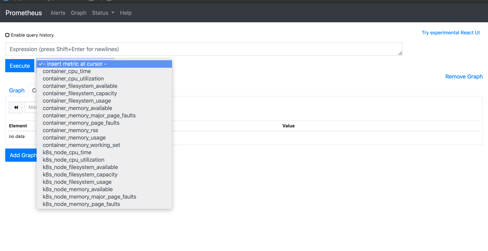
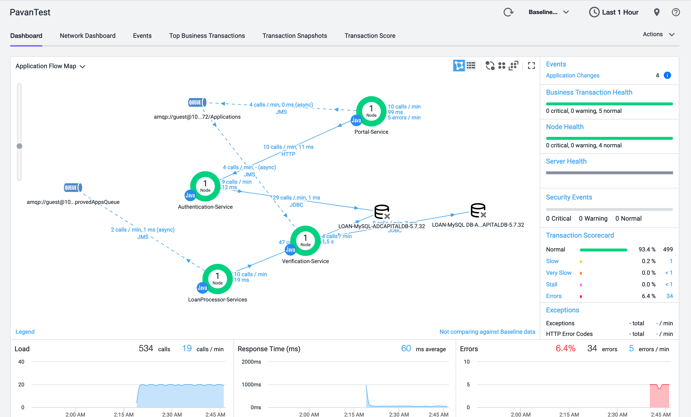

# AD-Capital-K8s-V1 

This directory contains K8s Resource Definition files to deploy AD-Capital application monitored using Java Agent
along with OpenTelemetry Collector to Monitor the K8 cluster

## Deploy AD-Capital to A Kubernetes Cluster

This directory contains all  Kubernetes resource definition files to deploy AD-Capital Application to a Kubernetes Cluster.
The following files need to modified to reflect the AppDynamics SaaS Controller being used:

| File      | Instructions |
| ----------- | ----------- |
| env-configmap.yaml      | Modify the fields: APPDYNAMICS_* to point to your controller       |
| secret.yaml   |  Base64 encode the Controller Account name and the Controller access key here. Use the command echo -n “XYZ” `|` base64 |
| otel-collector-svc.yml | |

## Services

| File      | Description |
| ----------- | ----------- |
| otel-agent-daemonset.yaml      | Per Node OpenTelemetry Collector |
| otel-collector.yaml      | "main" OpenTelemetry collector for transport to backends |
| adcapitaldb-deployment.yaml      | Database node running MySql |
| approval-deployment.yaml   | Approvals node using the new V2 image        |
| approval-deployment.yaml.instrumented | Original V1 approvals node deployment|
| rest-deployment.yaml   |  Rest API service node      |
| load-deployment.yaml | Load generator for AD-Capital |
| portal-deployment.yaml  | Portal node |       
| processor-deployment.yaml | Main processor for AD-Capital |
| rabbitmq-deployment.yaml   | Rabbit MQ message Queue Server |       
| verification-deployment.yaml | Verification Service node |
| secret.yaml  |   Base64 encoded environment variables     |
| env-configmap.yaml | Clear text environment variables |

## Deployment 

Once you have Kubernetes cluster (docker-desktop, minikube, EKS, GKE), apply the deployment files.

- $ `kubectl apply -f ../appd-apm-k8`

## Observability 

The Application is configured to be monitored by AppDynamics agents for APM and 
OpenTelemetry "Agents" for monitoring Kubernetes Infrastructure.

- The OpenTelemetry Metrics can be visualized in Prometheus Service at `http://<domain>:30002`
- The APM flow map can be visualized in the controller 

### K8 Metrics

### APM

