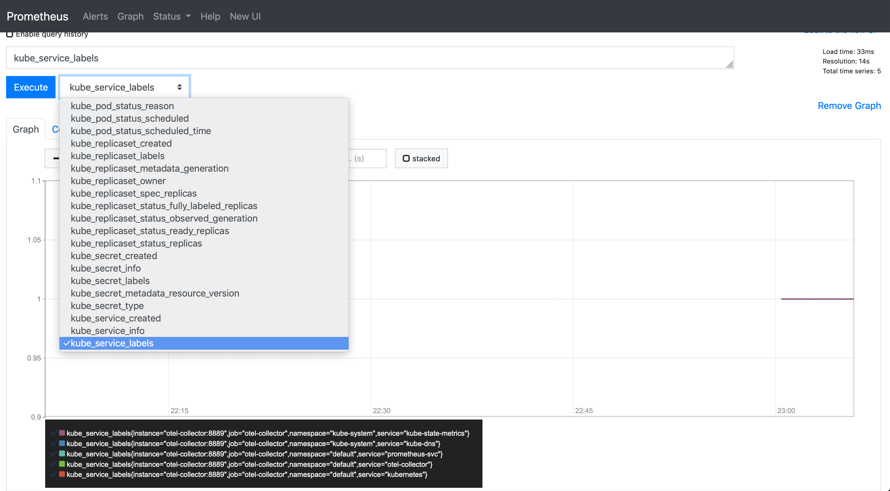

# Kubernetes Prometheus Demo

## Deployment

Once you have Kubernetes cluster (docker-desktop, minikube, EKS, GKE), apply the deployment files. 

- $ `kubectl apply -f ../k8-prom`

## Services

| File      | Description |
| ----------- | ----------- |
| otel-collector.yaml      | "main" OpenTelemetry collector for transport to backends |
| kubestats.yaml | Kube Stats exporter |
| prometheus-svc.yaml | Prometheus Service |

### K8 Metrics

